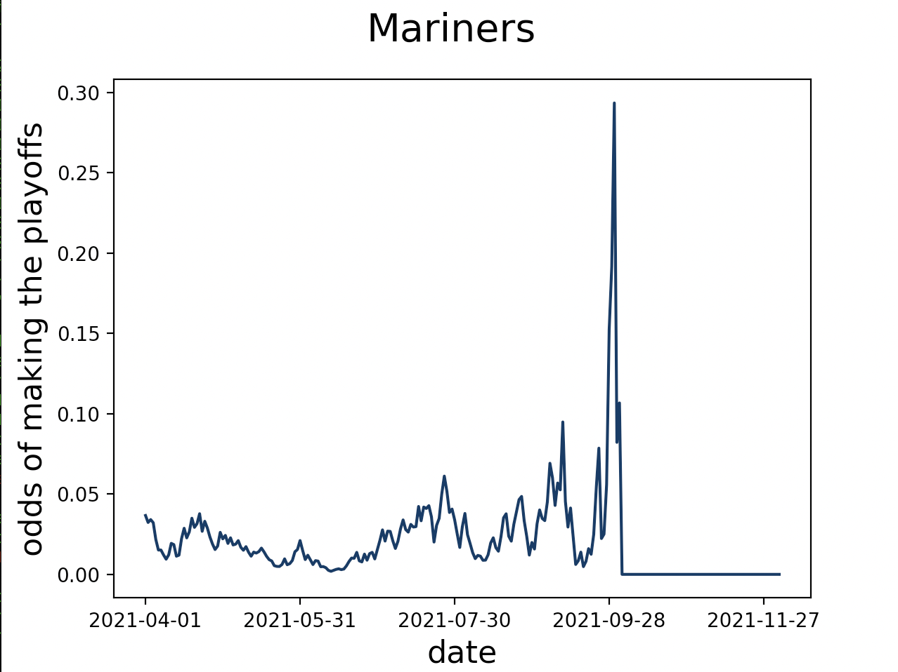

## MLB Playoff Odds (and other stats) Visualizer

#### Install Requirements

This project was built with the following:
```
Python 3.9.5
pip 21.1.1
```

Install libraries:
```
pip install -r requirements.txt
```

#### Example usage

The syntax is:
```
python run.py <team-name> <stat> <download (optional)>
```

For example, to get the Mariners' playoff odds over the course of the 2021 season
```
python run.py Mariners endData.poffTitle download
```

Get the Mariners' win percentage over the course of the 2021 season, but don't re-download the data
```
python run.py Mariners Wpct
```

#### List of stats you can use (See Fangraphs for Data Definitions)

```
['W', 'L', 'Wpct', 'GB', 'WCGB', 'dateEnd', 'deltaData', 'endData.ExpW', 'endData.ExpL', 'endData.rosW', 'endData.divTitle', 'endData.div2Title', 'endData.wcTitle', 'endData.poffTitle', 'endData.wcWin', 'endData.dsWin', 'endData.csWin', 'endData.wsWin', 'endData.sos']
```

#### Example Output


